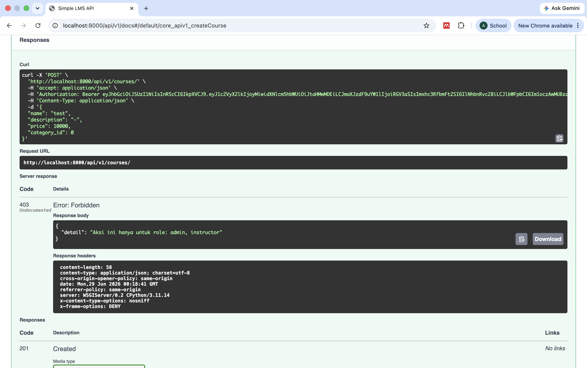

# Laporan Final Project — Simple LMS Extended Backend

## Identitas

- **Nama**: _Aurelia Dwi Wijayanti_
- **NIM**: _A11.2023.15263_
- **Mata Kuliah**: Pemrograman Sisi Server (A11.4618)
- **URL Repository**: _https://github.com/aaeilru/final-project-pss.git_

---

## Deskripsi Project

Simple LMS API adalah backend Learning Management System berbasis **Django
Ninja**. Project ini mendukung manajemen course berbasis kategori, enrollment,
progress belajar per-lesson, komentar/diskusi, serta tiga role pengguna (admin,
instructor, student) dengan otorisasi yang ketat.

Untuk final project, fitur tambahan yang dipilih adalah **Paket 5 —
Analytics & Activity Tracking** dan **Paket 6 — Async Processing &
Notification**, mengintegrasikan MongoDB untuk activity logging & analytics
report, serta Celery + RabbitMQ untuk background task processing, dengan
Flower sebagai dashboard monitoring.

---

## Fitur Dasar yang Sudah Berjalan

- Docker Compose (app, db, redis, mongodb, rabbitmq, celery-worker,
  celery-beat, flower) — semua service start dengan satu command
- PostgreSQL + migration berjalan otomatis lewat `entrypoint.sh`
- JWT Authentication (sign-in, token-refresh) — `django-ninja-simple-jwt`
- Role-based access control yang ketat: admin (`is_superuser`), instructor
  dan student (`Profile.role`), termasuk pembatasan ownership
- CRUD Course (dengan Category), CourseContent (lesson), Comment
- Enrollment (`CourseMember`) dan Progress belajar (`Progress`) yang
  benar-benar tersimpan ke database dan dihitung persentasenya
- Swagger/OpenAPI otomatis (`/api/v1/docs`)
- README lengkap, `.env.example`, data seed/demo, Postman collection

---

## Fitur Tambahan yang Dipilih

### Paket 5 — Analytics & Activity Tracking

| No  | Fitur                         | Poin | Status  |
| --- | ----------------------------- | ---- | ------- |
| 1   | Activity logging ke MongoDB   | 15   | Selesai |
| 2   | Learning analytics collection | 15   | Selesai |
| 3   | Course analytics report       | 15   | Selesai |
| 4   | Aggregation query MongoDB     | 15   | Selesai |

**Subtotal Paket 5**: 60 poin

### Paket 6 — Async Processing & Notification

| No  | Fitur                             | Poin | Status  |
| --- | --------------------------------- | ---- | ------- |
| 5   | Email notification async          | 12   | Selesai |
| 6   | Generate certificate/report async | 18   | Selesai |
| 7   | Scheduled task (Celery Beat)      | 15   | Selesai |
| 8   | Task status endpoint              | 12   | Selesai |
| 9   | Flower monitoring                 | 8    | Selesai |

**Subtotal Paket 6**: 65 poin

**Total poin (sebelum dibatasi)**: 125 poin
**Poin yang dihitung (sesuai aturan, maksimal 50)**: **50 poin**

---

## Penjelasan Implementasi

### Paket 5: Analytics & Activity Tracking

- **Activity logging**: setiap aksi penting (create/update/delete course,
  enroll, mark progress) dicatat ke collection MongoDB `activity_logs`
  (fungsi `log_activity` di `analytics/mongo_service.py`)
- **Learning analytics collection**: setiap kali student menandai progress,
  sebuah snapshot (`user_id`, `course_id`, `progress_percentage`,
  `completed`) disimpan ke collection `learning_analytics`
- **Course analytics report** (`GET /analytics/course-report/`): laporan
  per-course (total enrollment, completed_count, completion_rate),
  bersumber dari tabel PostgreSQL `CourseStatistics` yang diperbarui
  otomatis oleh Celery Beat (lihat Paket 6) — kombinasi data terstruktur
  (Postgres) dan event log (MongoDB)
- **Aggregation query MongoDB**: 3 pipeline aggregation berbeda sesuai
  - `GET /analytics/daily-active-users/` — jumlah user unik aktif per hari
  - `GET /analytics/course-popularity/` — total aktivitas & user unik per course
  - `GET /analytics/completion-summary/` — rasio completed vs total snapshot
    progress per course (dari collection `learning_analytics`)

### Paket 6: Async Processing & Notification

- `send_enrollment_email` — trigger otomatis saat `POST /course/{id}/enroll/`,
  mengirim email (mock, via Django console email backend) lewat Celery (`.delay()`)
- `generate_certificate` — trigger otomatis saat student menyelesaikan 100%
  konten course (dideteksi di `mark_progress`), membuat record `Certificate`
  dengan kode unik (idempoten — tidak duplikat jika dipanggil berkali-kali)
- `update_course_statistics` — **Celery Beat**, jalan otomatis tiap 5 menit,
  menghitung ulang & menyimpan statistik ke tabel `CourseStatistics`
- `export_course_report` — dipicu admin lewat `POST /admin/tasks/export-report/`,
  hasilnya bisa diunduh lewat `GET /admin/tasks/export-report/download/`
- `GET /tasks/{task_id}/status/` — cek status task apapun di atas
  (PENDING/STARTED/SUCCESS/FAILURE)
- **Flower** (`http://localhost:5555`) — dashboard monitoring worker & task real-time

### Role-Based Access Control (bagian dari Komponen Wajib)

- Hanya role **instructor**/**admin** yang bisa membuat course atau kategori baru
- Hanya **pemilik course** (atau admin) yang bisa update/delete course-nya
- Hanya **pemilik comment** (atau pengajar course terkait, atau admin) yang
  bisa edit/hapus comment
- Endpoint admin (`/admin/users/`, `/admin/tasks/*`, `/analytics/*`)
  dibatasi ketat untuk `is_superuser=True`

> **Catatan teknis penting**: project ini menggunakan mode JWT **stateless**
> (`ninja_simple_jwt` default), sehingga `request.user` bukan instance
> `User` asli melainkan objek ringan `TokenUser` dari klaim JWT.

---

## Cara Menjalankan Project

```bash
cp .env.example .env          # isi SECRET_KEY & password sesuai kebutuhan
docker-compose up -d --build  # migrate & JWT key digenerate otomatis
docker-compose exec app python manage.py seed_data   # data demo
```

Detail lengkap ada di `README.md`.

---

## Akun Demo

| Role       | Username                  | Password     |
| ---------- | ------------------------- | ------------ |
| Admin      | `admin01`                 | `admin12345` |
| Instructor | `dosen01` (s/d `dosen20`) | `dosen12345` |
| Student    | `mhs001` (s/d `mhs080`)   | `mhs12345`   |

---

## Endpoint Penting

**Paket 5 (Analytics)**

- `GET /api/v1/analytics/course-report/` (admin, instructor)
- `GET /api/v1/analytics/daily-active-users/` (admin)
- `GET /api/v1/analytics/course-popularity/` (admin)
- `GET /api/v1/analytics/completion-summary/` (admin)

**Paket 6 (Async Processing)**

- `POST /api/v1/course/{id}/enroll/` — trigger email async
- `POST /api/v1/enrollments/{id}/progress/` — trigger certificate async jika selesai
- `GET /api/v1/certificates/my/`
- `POST /api/v1/admin/tasks/export-report/` + `GET .../download/` (admin)
- `POST /api/v1/admin/tasks/update-statistics/` (admin)
- `GET /api/v1/tasks/{task_id}/status/`

**Pondasi & RBAC**

- `POST /api/v1/register/`, `POST /api/v1/auth/sign-in`
- `GET/POST /api/v1/courses/`, `GET/PUT/DELETE /api/v1/courses/{id}`
- `GET/POST /api/v1/categories/`
- `GET /api/v1/admin/users/`, `PUT /api/v1/admin/users/{id}/role/` (admin)

Dokumentasi lengkap & interaktif ada di Swagger: `/api/v1/docs`.

---

## Screenshot / Bukti Pengujian

### 1. RBAC & Permission

| Bukti                                                       | Screenshot                                                   |
| ----------------------------------------------------------- | ------------------------------------------------------------ |
| Student ditolak (403) saat mencoba membuat course           |    |
| Instructor berhasil membuat course "Course Testing" (201)   |  |
| Instructor berhasil membuat kategori baru (201)             |       |
| Course baru muncul di `GET /courses/` (publik, tanpa login) |        |

### 2. Enrollment, Progress & Certificate (Paket 6)

| Bukti                                                                                   | Screenshot                                                          |
| --------------------------------------------------------------------------------------- | ------------------------------------------------------------------- |
| Login sebagai student (`mhs001`)                                                        |              |
| Enroll ke course "Course Testing" (200)                                                 |              |
| Log `celery-worker`: email enrollment terkirim async                                    |            |
| `GET /enrollments/my-courses/` menunjukkan enrollment id 501                            |                 |
| Instructor membuat lesson "Lesson 1" via `POST /contents/`                              |                |
| Student menandai lesson selesai → `progress_percentage: 100`, `completed: true`         |         |
| `GET /certificates/my/` menunjukkan certificate `CERT-3A97B8D464` ter-generate otomatis |  |

### 3. Admin Tasks — Export Report & Scheduled Statistics (Paket 6)

| Bukti                                                                    | Screenshot                                                           |
| ------------------------------------------------------------------------ | -------------------------------------------------------------------- |
| Admin trigger `export_course_report` → dapat `task_id`                   |      |
| `GET /tasks/{task_id}/status/` → `status: SUCCESS`                       |        |
| Download CSV hasil export via `GET /admin/tasks/export-report/download/` |               |
| Isi CSV dibuka di spreadsheet — data course lengkap (30 baris)           |  |
| Admin trigger `update_course_statistics` manual → dapat `task_id`        |  |
| Admin list semua user beserta role (`admin`/`instructor`/`student`)      |           |
| Admin promote student jadi instructor via `PUT /admin/users/{id}/role/`  |                |

### 4. Analytics — Paket 5 (Aggregation MongoDB & Course Report)

| Bukti                                | Screenshot                                                    |
| ------------------------------------ | ------------------------------------------------------------- |
| `GET /analytics/daily-active-users/` |  |
| `GET /analytics/course-popularity/`  |   |
| `GET /analytics/completion-summary/` |  |
| `GET /analytics/activity-by-action/` |  |

### 5. Monitoring Infrastruktur (Celery, RabbitMQ, MongoDB, Redis)

| Bukti                                                                                  | Screenshot                                                                     |
| -------------------------------------------------------------------------------------- | ------------------------------------------------------------------------------ |
| Flower — task `update_course_statistics` SUCCESS (dijalankan Celery Beat tiap 5 menit) |                         |
| RabbitMQ Management — queue `celery` aktif & sehat                                     |                      |
| Flower dashboard (overview)                                                            |                      |
| MongoDB — koleksi `activity_logs`                                                      |            |
| MongoDB — koleksi `learning_analytics`                                                 |  |
| Redis caching — course list & detail                                                   |                    |
| Docker Compose — semua service `Up`                                                    |        |

### 6. Hasil Test Otomatis

```text
DJANGO_SETTINGS_MODULE=lms.settings_test python manage.py test courses -v 2
```

## 

## Kendala dan Solusi

| Kendala                                                                                                                                                                | Solusi                                                                                                                                                                                                                                                          |
| ---------------------------------------------------------------------------------------------------------------------------------------------------------------------- | --------------------------------------------------------------------------------------------------------------------------------------------------------------------------------------------------------------------------------------------------------------- |
| `seed_data.py` crash karena field `member_id` tidak ada di model `Comment`                                                                                             | Diperbaiki menjadi `user_id=member.user_id`                                                                                                                                                                                                                     |
| Endpoint `mark_progress` tidak pernah menyimpan progress ke database                                                                                                   | Ditambahkan model `Progress`, dihitung ulang persentasenya                                                                                                                                                                                                      |
| Task `generate_certificate` & `update_course_statistics` tidak pernah menyimpan hasilnya                                                                               | Ditambahkan model `Certificate` & `CourseStatistics`, task diupdate agar persist ke DB                                                                                                                                                                          |
| `request.user` (TokenUser stateless dari JWT) menyebabkan beberapa endpoint crash/permission salah (`update_profile`, `postComment`, `updateComment`, `deleteComment`) | Diperbaiki dengan mengambil ulang `User` asli dari DB atau membandingkan `.id` secara eksplisit                                                                                                                                                                 |
| Test Celery selalu gagal konek ke `redis:6379` walau `CELERY_TASK_ALWAYS_EAGER=True` di `settings_test.py`                                                             | Celery membaca `CELERY_RESULT_BACKEND` langsung dari `os.environ` (prioritas lebih tinggi dari Django settings), dan variabel itu "bocor" dari `.env` lewat `load_dotenv()`. Solusi: `os.environ.pop("CELERY_RESULT_BACKEND", None)` di awal `settings_test.py` |
| Aggregation pipeline MongoDB pakai `$round` tidak didukung `mongomock` (dipakai untuk testing)                                                                         | Pembulatan dipindah ke Python setelah data diambil dari MongoDB                                                                                                                                                                                                 |
| Private key JWT (`jwt-signing.pem`) ikut ter-commit di repository                                                                                                      | Dihapus dari repo, ditambahkan ke `.gitignore`, digenerate otomatis oleh `entrypoint.sh`                                                                                                                                                                        |
| Password DB/Mongo/RabbitMQ hardcoded di `docker-compose.yml` & `settings.py`                                                                                           | Dipindah ke `.env` (lihat `.env.example`)                                                                                                                                                                                                                       |
| Tidak ada test sama sekali                                                                                                                                             | Ditambahkan 46 test case yang berjalan dengan SQLite + Celery eager + mongomock tanpa perlu Docker                                                                                                                                                              |

---

## Kesimpulan

_Mengerjakan final project ini mengajarkan saya bahwa kode yang "kelihatan jalan" dan kode yang "benar-benar jalan" itu dua hal yang berbeda. Project yang saya lanjutkan sudah punya fondasi yang cukup lengkap (Redis, MongoDB, Celery), tapi setelah ditelusuri ulang, ternyata ada beberapa fitur yang sebenarnya tidak pernah benar-benar tersambung — misalnya endpoint progress yang tidak menyimpan apa pun ke database, atau task Celery yang tidak pernah dipanggil dari mana pun. Ini membuat saya sadar pentingnya selalu menguji endpoint secara end-to-end, bukan hanya membaca kode dan berasumsi semuanya bekerja.
Bug yang paling berkesan buat saya adalah soal TokenUser di JWT stateless — ternyata request.user tidak selalu berupa objek User Django biasa, dan ini bisa menyebabkan bug yang halus sekali (seperti pemilik komentar yang tidak bisa edit komentarnya sendiri) yang tidak akan ketahuan kalau tidak ditest secara spesifik. Begitu juga dengan masalah Celery yang membaca CELERY_RESULT_BACKEND langsung dari environment variable, bukan dari Django settings — ini mengajarkan saya bahwa debugging itu kadang butuh menelusuri sampai ke level library/dependency, bukan cuma kode sendiri.
Dari sisi teknis, saya jadi lebih paham bagaimana Redis caching, MongoDB activity logging, dan Celery background task saling melengkapi dalam sebuah backend yang realistis — Redis untuk performa baca, MongoDB untuk pencatatan event yang fleksibel, dan Celery untuk pekerjaan berat yang tidak boleh memblokir response API. Saya juga belajar pentingnya menulis test sejak awal: 51 test case yang akhirnya saya punya bukan cuma syarat nilai, tapi benar-benar membantu saya yakin bahwa perubahan kode tidak merusak fitur yang sudah jalan sebelumnya._
