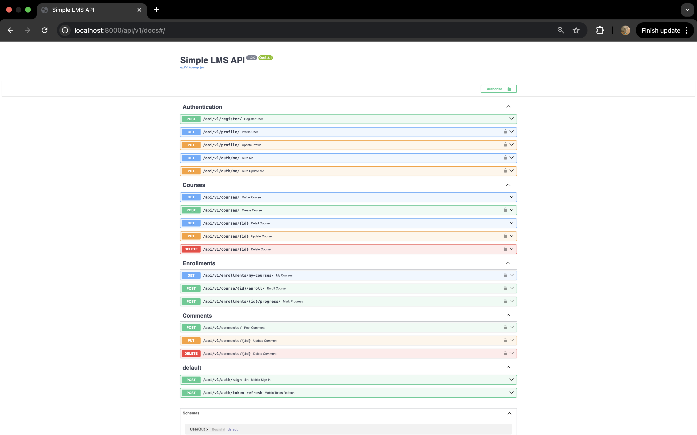
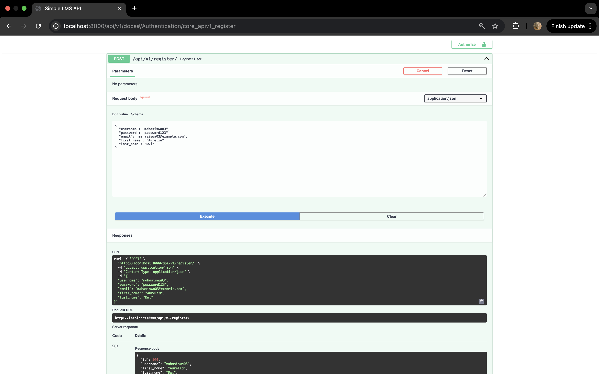
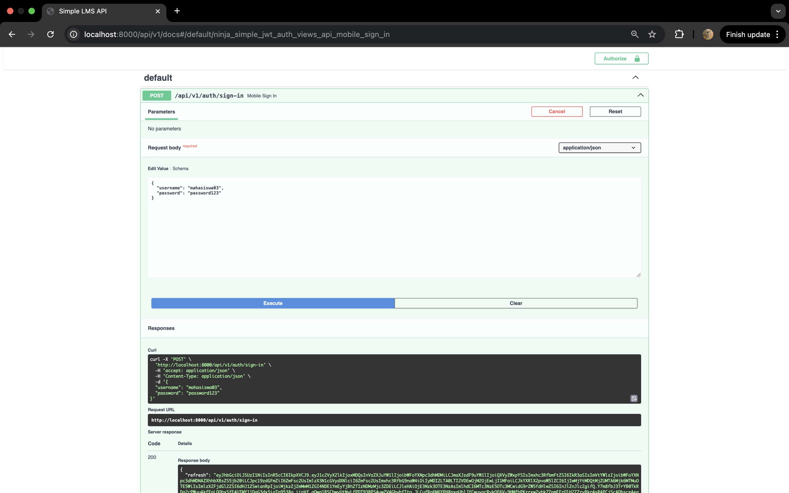
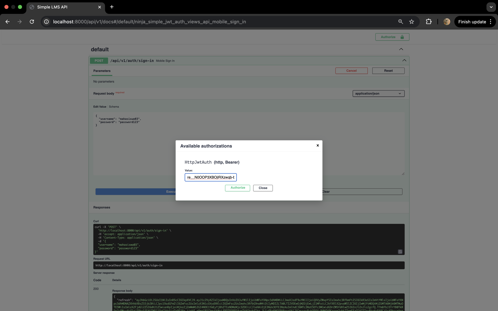
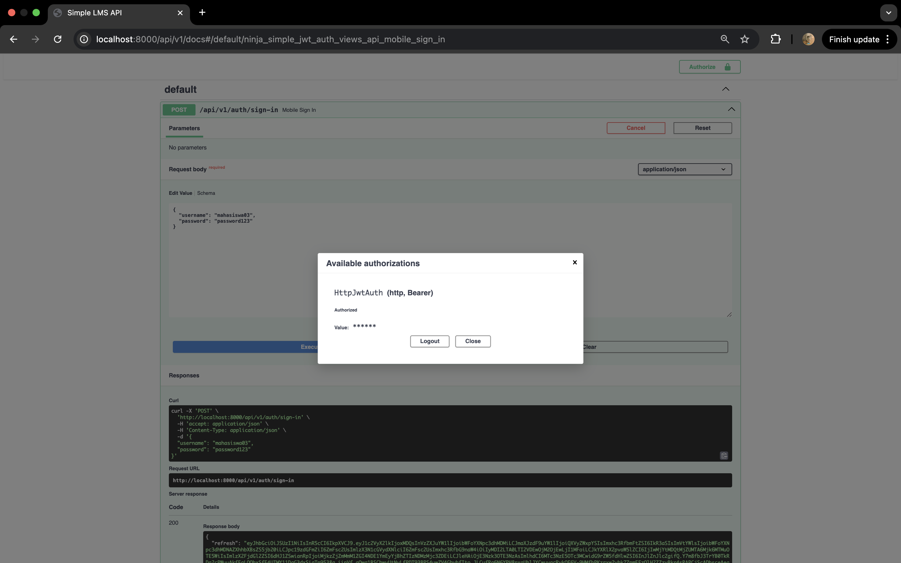
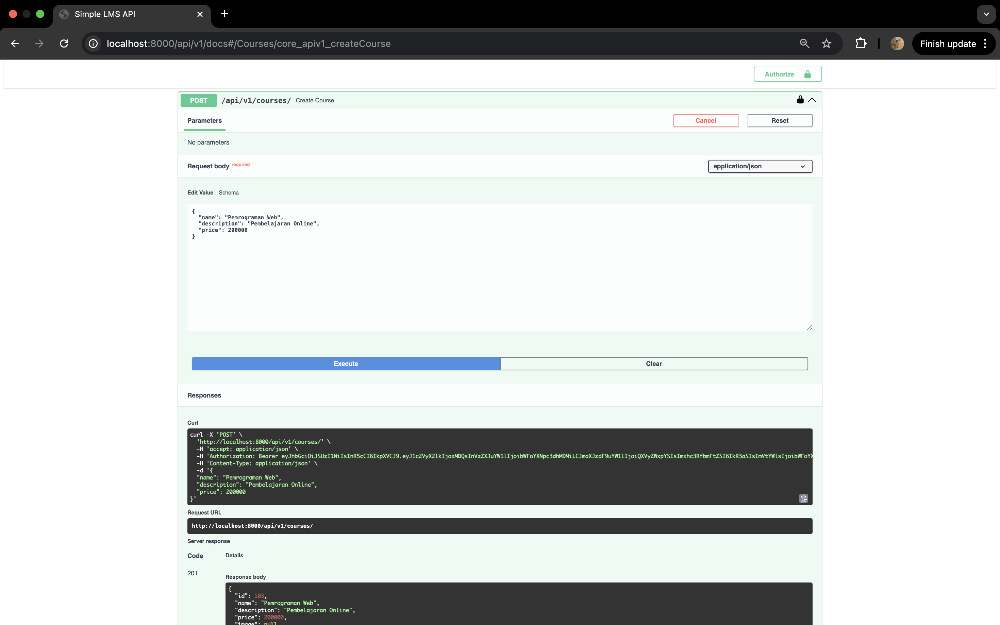
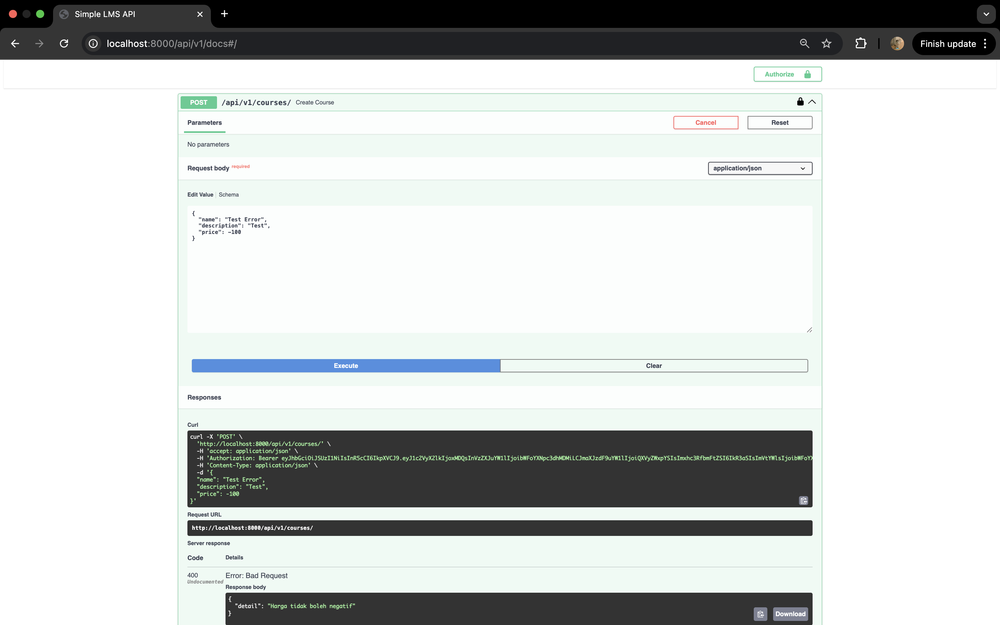
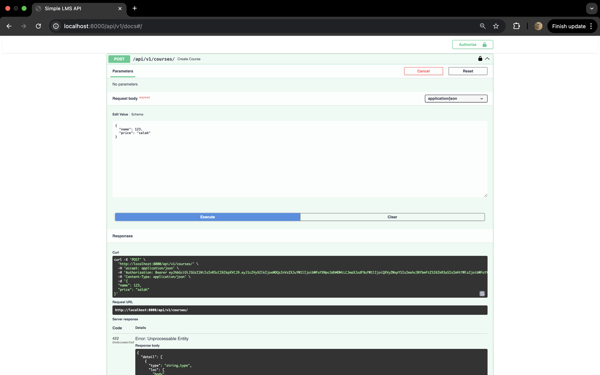
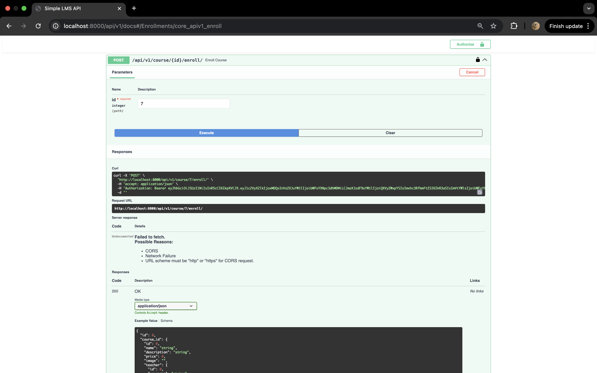

# Simple LMS API

Simple LMS API adalah backend Learning Management System sederhana berbasis **Django Ninja** dengan fitur **JWT Authentication**, manajemen course, enrollment, progress pembelajaran, komentar, schema validation, error handling, dan dokumentasi otomatis menggunakan Swagger.

---

## Cara Menjalankan Project

### 1. Jalankan container

```bash
docker-compose up -d
```

### 2. Jalankan migrasi database

```bash
docker-compose exec app python manage.py migrate
```

### 3. Buat superuser

```bash
docker-compose exec app python manage.py createsuperuser
```

### 4. Generate RSA key untuk JWT

```bash
docker-compose exec app python manage.py make_rsa
```

### 5. Jalankan server

```bash
docker-compose exec app python manage.py runserver 0.0.0.0:8000
```

### 6. Akses Swagger Documentation

```text
http://localhost:8000/api/v1/docs
```

---

### Tampilan Swagger



### Register User



### Login JWT



### Authorize Token




### Create Course



### Error Handling 400



### Validation Error 422



### Enroll Course



---

## Authentication Endpoints

| Method | Endpoint | Auth | Keterangan |
|---|---|---|---|
| POST | `/api/v1/register/` | Tidak | Register user baru |
| POST | `/api/v1/auth/sign-in` | Tidak | Login dan mendapatkan access token serta refresh token |
| POST | `/api/v1/auth/token-refresh` | Tidak | Refresh access token |
| GET | `/api/v1/profile/` | Ya | Melihat profil user yang sedang login |
| PUT | `/api/v1/profile/` | Ya | Mengupdate profil user yang sedang login |
| GET | `/api/v1/auth/me/` | Ya | Melihat data user yang sedang login |
| PUT | `/api/v1/auth/me/` | Ya | Mengupdate data user yang sedang login |

> Catatan: Endpoint login dan refresh token menggunakan endpoint bawaan dari library `ninja-simple-jwt`, yaitu `/auth/sign-in` dan `/auth/token-refresh`.

---

## Courses Endpoints

| Method | Endpoint | Auth | Keterangan |
|---|---|---|---|
| GET | `/api/v1/courses/` | Tidak | Menampilkan daftar course |
| GET | `/api/v1/courses/{id}` | Tidak | Menampilkan detail course berdasarkan ID |
| POST | `/api/v1/courses/` | Ya | Membuat course baru |
| PUT | `/api/v1/courses/{id}` | Ya | Mengupdate course berdasarkan ID |
| DELETE | `/api/v1/courses/{id}` | Ya | Menghapus course berdasarkan ID |

---

## Enrollment Endpoints

| Method | Endpoint | Auth | Keterangan |
|---|---|---|---|
| POST | `/api/v1/course/{id}/enroll/` | Ya | Mendaftarkan user ke course tertentu |
| GET | `/api/v1/enrollments/my-courses/` | Ya | Menampilkan daftar course yang diikuti user |
| POST | `/api/v1/enrollments/{id}/progress/` | Ya | Menandai progress lesson sebagai selesai |

---

## Comment Endpoints

| Method | Endpoint | Auth | Keterangan |
|---|---|---|---|
| POST | `/api/v1/comments/` | Ya | Menambahkan komentar pada content |
| PUT | `/api/v1/comments/{id}` | Ya | Mengupdate komentar berdasarkan ID |
| DELETE | `/api/v1/comments/{id}` | Ya | Menghapus komentar berdasarkan ID |

---

## Postman Collection

Pengujian API juga dilakukan menggunakan Postman Collection yang telah disertakan dalam repository.

File collection:

```text
postman/Simple-LMS-API.postman_collection.json
```

---

## Catatan

Endpoint login dan refresh token menggunakan endpoint bawaan dari library `ninja-simple-jwt`:

```text
POST /api/v1/auth/sign-in
POST /api/v1/auth/token-refresh
```

---
