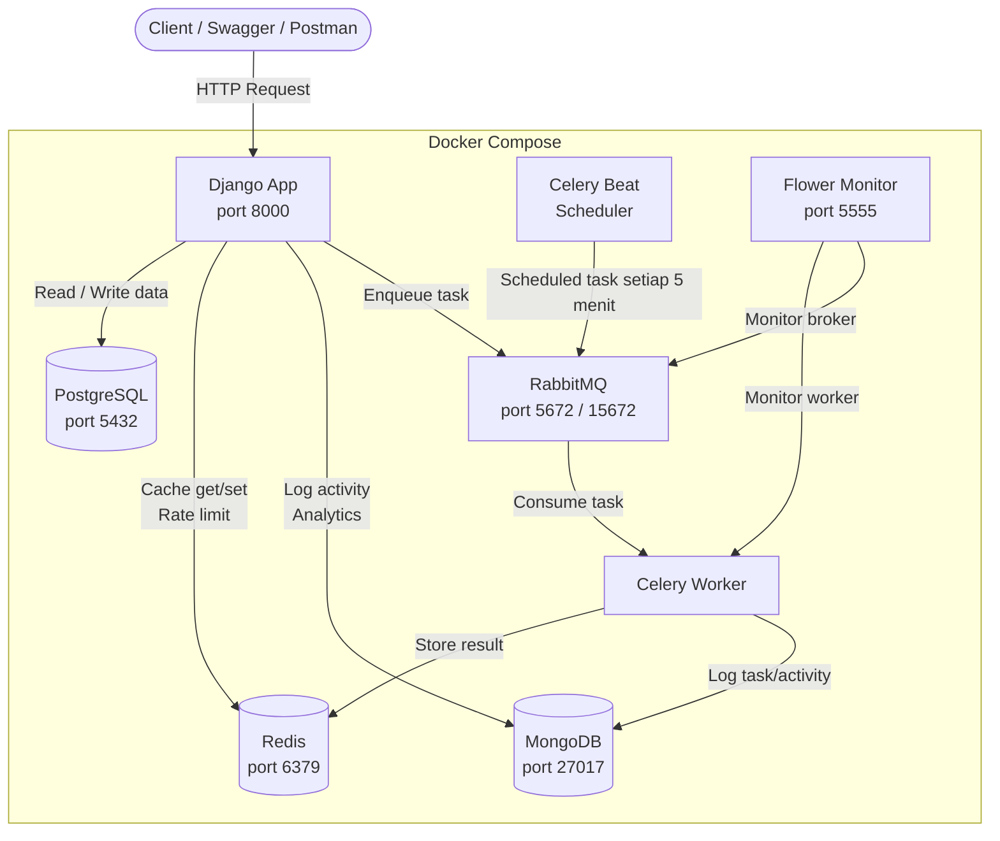

# Simple LMS API — Advanced Integration

Simple LMS API adalah backend Learning Management System berbasis **Django Ninja** dengan fitur JWT Authentication, manajemen course, enrollment, progress pembelajaran, komentar, **Redis caching**, **MongoDB activity logging & learning analytics**, **Celery asynchronous tasks**, **RabbitMQ message broker**, **Celery Beat scheduler**, **Flower monitoring**, dan **benchmark performance**.

---

## Learning Objectives

Project ini menerapkan:

- Redis caching patterns
- MongoDB integration untuk document storage
- Asynchronous task processing dengan Celery
- Message queue menggunakan RabbitMQ
- Rate limiting implementation

---

## Cara Menjalankan Project

### 1. Jalankan semua services

```bash
docker-compose up -d --build
```

### 2. Jalankan migrasi database

```bash
docker-compose exec app python manage.py migrate
```

### 3. Buat superuser

```bash
docker-compose exec app python manage.py createsuperuser
```

### 4. Generate RSA key untuk JWT

```bash
docker-compose exec app python manage.py make_rsa
```

### 5. Akses layanan

| Layanan | URL |
|---|---|
| Swagger API Docs | http://localhost:8000/api/v1/docs |
| RabbitMQ Management | http://localhost:15672 |
| Flower Celery Monitor | http://localhost:5555 |

Login RabbitMQ:

```text
username: admin
password: password
```

---

# Architecture Diagram



---

# Docker Compose Services

Docker Compose menjalankan seluruh service yang dibutuhkan oleh aplikasi.

| Service | Fungsi |
|---|---|
| app / web | Django application |
| db | PostgreSQL database utama |
| redis | Redis caching dan Celery result backend |
| mongodb | MongoDB activity logs dan learning analytics |
| rabbitmq | Message broker untuk Celery |
| celery-worker | Menjalankan background task |
| celery-beat | Menjalankan scheduled task |
| flower | Monitoring Celery task dan worker |

Command pengecekan:

```bash
docker-compose ps
```

## Screenshot Docker Services


---

# Swagger API Documentation

Swagger digunakan untuk menguji endpoint API seperti authentication, course, enrollment, analytics, dan admin task.

URL:

```text
http://localhost:8000/api/v1/docs
```

## Screenshot Swagger API


---

# Redis Integration

Redis digunakan sebagai cache layer untuk mengurangi query PostgreSQL pada data course yang sering diakses.

## 1. Course List Caching

Endpoint:

```http
GET /api/v1/courses/
```

Redis key:

```text
:1:courses_list
```

TTL:

```text
300 detik
```

Command pengecekan:

```bash
docker-compose exec redis redis-cli -n 1 KEYS "*"
```

## Screenshot Course List Cache


---

## 2. Course Detail Caching

Endpoint:

```http
GET /api/v1/courses/{id}
```

Redis key:

```text
:1:course_detail:{id}
```

Contoh:

```text
:1:course_detail:1
```

Command pengecekan:

```bash
docker-compose exec redis redis-cli -n 1 KEYS "*"
```

## Screenshot Course Detail Cache


---

## 3. Redis TTL

TTL digunakan agar data cache memiliki waktu kedaluwarsa.

Command pengecekan:

```bash
docker-compose exec redis redis-cli -n 1 TTL ":1:courses_list"
docker-compose exec redis redis-cli -n 1 TTL ":1:course_detail:1"
```

## Screenshot Redis TTL


---

## 4. Caching Strategy Explanation

Strategi caching yang digunakan adalah **cache-aside pattern**.

Alur caching:

```text
Request masuk
    │
    ▼
cache.get(key)
    │
    ├─ HIT  ──► return cached data tanpa query database
    │
    └─ MISS ──► query PostgreSQL
                    │
                    ▼
              cache.set(key, data, timeout=300)
                    │
                    ▼
              return data
```

---

## 5. Cache Invalidation Strategy

Cache dihapus ketika terjadi operasi write agar data tidak stale.

### Create Course

```python
cache.delete("courses_list")
```

### Update Course

```python
cache.delete("courses_list")
cache.delete(f"course_detail:{id}")
```

### Delete Course

```python
cache.delete("courses_list")
cache.delete(f"course_detail:{id}")
```

Command bukti invalidasi:

```bash
docker-compose exec redis redis-cli -n 1 KEYS "*"
```

## Screenshot Cache Invalidation


---

## 6. Rate Limiting

Rate limiting diterapkan menggunakan Redis counter.

Limit:

```text
60 requests / minute
```

Jika melebihi limit, API mengembalikan:

```json
{
  "detail": "Rate limit exceeded. Maksimal 60 requests per minute."
}
```

Status code:

```text
429 Too Many Requests
```

## Screenshot Rate Limiting


---

## 7. Redis CLI Commands Documentation

Masuk Redis CLI:

```bash
docker-compose exec redis redis-cli
```

Cek koneksi:

```bash
PING
```

Melihat semua key pada Redis DB 1:

```bash
docker-compose exec redis redis-cli -n 1 KEYS "*"
```

Melihat TTL course list:

```bash
docker-compose exec redis redis-cli -n 1 TTL ":1:courses_list"
```

Melihat TTL course detail:

```bash
docker-compose exec redis redis-cli -n 1 TTL ":1:course_detail:1"
```

Menghapus seluruh cache DB 1:

```bash
docker-compose exec redis redis-cli -n 1 FLUSHDB
```

Melihat counter rate limit:

```bash
docker-compose exec redis redis-cli -n 1 KEYS "*rate_limit*"
```

## Screenshot Redis CLI Monitoring


---

# MongoDB Integration

MongoDB digunakan untuk menyimpan data berbentuk dokumen, yaitu **activity logs** dan **learning analytics**.

Database:

```text
lms_analytics
```

## 1. Activity Log Collection

Collection:

```text
activity_logs
```

Collection ini menyimpan aktivitas user seperti:

- create_course
- update_course
- delete_course
- enroll
- progress
- comment

Contoh dokumen:

```json
{
  "user_id": 1,
  "action": "create_course",
  "course_id": 1,
  "course_name": "metopen",
  "timestamp": "2026-06-01T14:04:55.051Z",
  "metadata": {}
}
```

Command pengecekan:

```bash
docker exec -it lms-mongodb mongosh -u admin -p password
```

```javascript
use lms_analytics
db.activity_logs.find().pretty()
```

## Screenshot Activity Logs


---

## 2. Learning Analytics Collection

Collection:

```text
learning_analytics
```

Collection ini digunakan untuk menyimpan data analitik pembelajaran seperti progress user, completion status, dan aktivitas belajar.

Contoh dokumen:

```json
{
  "user_id": 1,
  "course_id": 1,
  "progress_percentage": 100,
  "completed": true,
  "timestamp": "2026-06-01T14:10:00.000Z"
}
```

Command pengecekan:

```javascript
use lms_analytics
db.learning_analytics.find().pretty()
```

## Screenshot Learning Analytics


---

## 3. Aggregation Queries untuk Reports

### Activity by Action

```javascript
db.activity_logs.aggregate([
  {
    $group: {
      _id: "$action",
      total: { $sum: 1 }
    }
  },
  {
    $sort: {
      total: -1
    }
  }
])
```

Endpoint API:

```http
GET /api/v1/analytics/activity-by-action/
```

### Activity by Course

```javascript
db.activity_logs.aggregate([
  {
    $match: {
      course_id: { $ne: null }
    }
  },
  {
    $group: {
      _id: "$course_name",
      total_activity: { $sum: 1 }
    }
  },
  {
    $sort: {
      total_activity: -1
    }
  }
])
```

Endpoint API:

```http
GET /api/v1/analytics/activity-by-course/
```

## Screenshot MongoDB Aggregation


---

# Celery Tasks

Celery digunakan untuk menjalankan proses asynchronous di background agar request API tidak perlu menunggu proses berat selesai.

Celery menggunakan:

- RabbitMQ sebagai message broker
- Redis sebagai result backend
- Celery Beat sebagai scheduler
- Flower sebagai monitoring dashboard

## Daftar Celery Tasks

| Task | Trigger | Tipe |
|---|---|---|
| send_enrollment_email | Saat student enroll course | Async on-demand |
| generate_certificate | Saat student menyelesaikan course | Async on-demand |
| update_course_statistics | Otomatis setiap 5 menit | Scheduled |
| export_course_report | Manual via admin task endpoint | Async on-demand |

## 1. send_enrollment_email

Task ini berjalan ketika student enroll course.

Trigger:

```http
POST /api/v1/course/{id}/enroll/
```

Contoh pemanggilan task:

```python
send_enrollment_email.delay(user.id, course.id)
```

## Screenshot send_enrollment_email


---

## 2. generate_certificate

Task ini digunakan untuk generate certificate ketika student menyelesaikan course.

## Screenshot generate_certificate


---

## 3. update_course_statistics

Task ini berjalan otomatis menggunakan Celery Beat untuk update statistik course.

Contoh log:

```text
Task courses.tasks.update_course_statistics received
Course statistics updated
Task courses.tasks.update_course_statistics succeeded
```

## Screenshot Scheduled Task


---

## 4. export_course_report

Task ini digunakan untuk generate CSV report course secara asynchronous.

Output:

```text
reports/course_report.csv
```

## Screenshot export_course_report


---

## Screenshot Celery Tasks Code

Screenshot ini menunjukkan file `courses/tasks.py` berisi minimal empat task yang diminta.


---

## Task Flow Documentation

### Enrollment Task Flow

```text
POST /course/{id}/enroll/
        │
        ▼
Simpan enrollment ke PostgreSQL
        │
        ▼
Simpan activity log ke MongoDB
        │
        ▼
send_enrollment_email.delay(user_id, course_id)
        │
        ▼
RabbitMQ Queue
        │
        ▼
Celery Worker mengambil task
        │
        ▼
Task dijalankan di background
        │
        ▼
Result disimpan ke Redis result backend
```

### Scheduled Task Flow

```text
Celery Beat setiap 5 menit
        │
        ▼
Enqueue update_course_statistics ke RabbitMQ
        │
        ▼
Celery Worker menerima task
        │
        ▼
Worker menghitung enrollment count tiap course
        │
        ▼
Task selesai dan termonitor di Flower
```

---

# Monitoring

Monitoring dilakukan menggunakan Flower, RabbitMQ Management UI, Redis CLI, dan log Celery Worker.

## 1. Celery Worker Logs

Command:

```bash
docker-compose logs celery-worker --tail=80
```

## Screenshot Celery Worker Logs


---

## 2. Flower Monitoring

URL:

```text
http://localhost:5555
```

Flower digunakan untuk monitoring:

- Celery workers
- Task status
- Task runtime
- Task success / failure

## Screenshot Flower Dashboard


---

## 3. RabbitMQ Monitoring

URL:

```text
http://localhost:15672
```

Login:

```text
username: admin
password: password
```

RabbitMQ Management digunakan untuk monitoring:

- Queue
- Connection
- Channel
- Message broker status

## Screenshot RabbitMQ Dashboard


---

## 4. Redis CLI Monitoring

Command:

```bash
docker-compose exec redis redis-cli -n 1 KEYS "*"
docker-compose exec redis redis-cli -n 1 TTL ":1:courses_list"
```

## Screenshot Redis Monitoring


---

# Benchmark Performance

Benchmark dilakukan untuk mengukur response time endpoint course setelah caching aktif.

File:

```text
benchmark.py
```

Command:

```bash
python3 benchmark.py
```

Contoh hasil benchmark:

```text
GET /courses/
  Success   : 50
  Failed    : 0
  Rata-rata : 4.38 ms
  Minimum   : 2.03 ms
  Maksimum  : 35.83 ms

GET /courses/1
  Success   : 50
  Failed    : 0
  Rata-rata : 2.62 ms
  Minimum   : 1.96 ms
  Maksimum  : 20.45 ms
```

Setelah benchmark dijalankan, Redis menyimpan:

```text
:1:courses_list
:1:course_detail:1
```

TTL cache aktif:

```text
(integer) 210
```

## Screenshot Benchmark Result


---

# API Endpoints

## Authentication Endpoints

| Method | Endpoint | Auth | Keterangan |
|---|---|---|---|
| POST | /api/v1/register/ | Tidak | Register user baru |
| POST | /api/v1/auth/sign-in | Tidak | Login, dapat access dan refresh token |
| POST | /api/v1/auth/token-refresh | Tidak | Refresh access token |
| GET | /api/v1/profile/ | Ya | Lihat profil user login |
| PUT | /api/v1/profile/ | Ya | Update profil user login |

## Courses Endpoints

| Method | Endpoint | Auth | Keterangan |
|---|---|---|---|
| GET | /api/v1/courses/ | Tidak | Daftar course, Redis cached, rate limited |
| GET | /api/v1/courses/{id} | Tidak | Detail course, Redis cached, rate limited |
| POST | /api/v1/courses/ | Ya | Buat course baru |
| PUT | /api/v1/courses/{id} | Ya | Update course |
| DELETE | /api/v1/courses/{id} | Ya | Hapus course |

## Enrollment Endpoints

| Method | Endpoint | Auth | Keterangan |
|---|---|---|---|
| POST | /api/v1/course/{id}/enroll/ | Ya | Enroll course, trigger send_enrollment_email |
| GET | /api/v1/enrollments/my-courses/ | Ya | Daftar course yang diikuti |
| POST | /api/v1/enrollments/{id}/progress/ | Ya | Tandai progress, trigger generate_certificate jika selesai |

## Analytics Endpoints Admin Only

| Method | Endpoint | Auth | Keterangan |
|---|---|---|---|
| GET | /api/v1/analytics/activity-by-action/ | Admin | Aggregasi aktivitas per action |
| GET | /api/v1/analytics/activity-by-course/ | Admin | Aggregasi aktivitas per course |

## Admin Task Endpoints Admin Only

| Method | Endpoint | Auth | Keterangan |
|---|---|---|---|
| POST | /api/v1/admin/tasks/export-report/ | Admin | Trigger export CSV async |
| POST | /api/v1/admin/tasks/update-statistics/ | Admin | Trigger update statistik manual |

---
