# Simple LMS API — Advanced Integration

Simple LMS API adalah backend Learning Management System berbasis **Django Ninja** dengan fitur JWT Authentication, manajemen course, enrollment, progress pembelajaran, komentar, **Redis caching**, **MongoDB activity logging & learning analytics**, **Celery asynchronous tasks**, **RabbitMQ message broker**, **Celery Beat scheduler**, **Flower monitoring**, dan **benchmark performance**.

---

## Learning Objectives

Project ini menerapkan:

- Redis caching patterns
- MongoDB integration untuk document storage
- Asynchronous task processing dengan Celery
- Message queue menggunakan RabbitMQ
- Rate limiting implementation
- Role-based access control (admin / instructor / student)

---

## Model Data Utama

| Model                    | Keterangan                                                                               |
| ------------------------ | ---------------------------------------------------------------------------------------- |
| `User` (Django built-in) | Akun login                                                                               |
| `Profile`                | Role tambahan (`instructor`/`student`) untuk User. Admin = `is_superuser=True`           |
| `Category`               | Kategori/topik course                                                                    |
| `Course`                 | Mata kuliah/course, terhubung ke `Category` dan `teacher`                                |
| `CourseContent`          | Lesson/konten di dalam sebuah course (mendukung hierarki via `parent_id`)                |
| `CourseMember`           | Enrollment — relasi student ke course                                                    |
| `Progress`               | Riwayat konten yang sudah diselesaikan per enrollment (basis hitung persentase progress) |
| `Comment`                | Komentar/diskusi pada sebuah konten                                                      |

---

## Cara Menjalankan Project

### 1. Siapkan file environment variable

```bash
cp .env.example .env
```

Lalu edit `.env` dan isi `SECRET_KEY`, password PostgreSQL, MongoDB, dan
RabbitMQ dengan nilai yang aman (jangan pakai nilai contoh untuk production).

### 2. Jalankan semua services

```bash
docker-compose up -d --build
```

Container `app` otomatis menjalankan `entrypoint.sh` yang akan:

- Menunggu PostgreSQL siap
- Generate JWT signing key (`jwt-signing.pem` / `jwt-signing.pub`) jika belum ada
- Menjalankan migrasi database
- Menjalankan development server

Jadi **tidak perlu lagi** menjalankan migrate/make_jwt_key secara manual di
percobaan pertama. Cukup tunggu beberapa detik lalu cek:

```bash
docker-compose logs app --tail=30
```

### 3. Buat superuser (opsional, jika tidak pakai seed data)

```bash
docker-compose exec app python manage.py createsuperuser
```

### 4. Isi data demo (sangat disarankan)

```bash
docker-compose exec app python manage.py seed_data
```

Seed data akan otomatis membuat akun demo dengan role yang jelas (admin,
instructor, student) — lihat bagian [Akun Demo](#akun-demo) di bawah.

### 5. Akses layanan

| Layanan               | URL                               |
| --------------------- | --------------------------------- |
| Swagger API Docs      | http://localhost:8000/api/v1/docs |
| RabbitMQ Management   | http://localhost:15672            |
| Flower Celery Monitor | http://localhost:5555             |

Login RabbitMQ: gunakan `RABBITMQ_DEFAULT_USER` / `RABBITMQ_DEFAULT_PASS`
sesuai isi file `.env` Anda.

---

## Akun Demo

Setelah menjalankan `python manage.py seed_data`, akun berikut tersedia:

| Role       | Username                | Password     | Keterangan                                                 |
| ---------- | ----------------------- | ------------ | ---------------------------------------------------------- |
| Admin      | `admin01`               | `admin12345` | Superuser, akses penuh termasuk endpoint admin & analytics |
| Instructor | `dosen01` ... `dosen20` | `dosen12345` | Bisa membuat/mengelola course miliknya                     |
| Student    | `mhs001` ... `mhs080`   | `mhs12345`   | Bisa enroll, mengerjakan progress, comment                 |

---

## Role-Based Access Control (RBAC)

Project ini punya 3 role: **admin**, **instructor**, **student**.

- **admin** = `User.is_superuser = True` (dibuat lewat `createsuperuser` atau diset lewat Django Admin). Admin **tidak bisa dibuat lewat endpoint `/register/`**.
- **instructor** dan **student** disimpan di model `Profile.role`, dan ditentukan saat registrasi lewat field `role` (default `student`).
- Endpoint `/admin/users/` dan `/admin/users/{id}/role/` (admin only) bisa dipakai untuk mempromosikan seorang student menjadi instructor.

| Aksi                                                 | Student            | Instructor    | Admin    |
| ---------------------------------------------------- | ------------------ | ------------- | -------- |
| Lihat/cari course (`GET /courses/`)                  | ✅                 | ✅            | ✅       |
| Buat course (`POST /courses/`)                       | ❌                 | ✅            | ✅       |
| Edit/hapus course                                    | hanya pemilik      | hanya pemilik | ✅ semua |
| Enroll course                                        | ✅                 | ✅            | ✅       |
| Tandai progress lesson                               | ✅ (punya sendiri) | -             | -        |
| Buat kategori                                        | ❌                 | ✅            | ✅       |
| Lihat analytics MongoDB                              | ❌                 | ❌            | ✅       |
| Trigger admin task (export report, update statistik) | ❌                 | ❌            | ✅       |
| Kelola role user lain                                | ❌                 | ❌            | ✅       |

---

# Architecture Diagram


---

# Docker Compose Services

Docker Compose menjalankan seluruh service yang dibutuhkan oleh aplikasi.

| Service       | Fungsi                                       |
| ------------- | -------------------------------------------- |
| app / web     | Django application                           |
| db            | PostgreSQL database utama                    |
| redis         | Redis caching dan Celery result backend      |
| mongodb       | MongoDB activity logs dan learning analytics |
| rabbitmq      | Message broker untuk Celery                  |
| celery-worker | Menjalankan background task                  |
| celery-beat   | Menjalankan scheduled task                   |
| flower        | Monitoring Celery task dan worker            |

Command pengecekan:

```bash
docker-compose ps
```

## Screenshot Docker Services

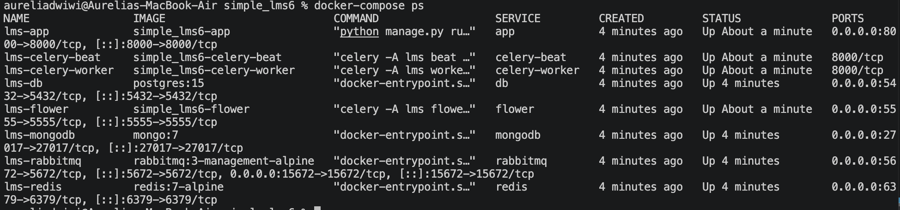

---

# Swagger API Documentation

Swagger digunakan untuk menguji endpoint API seperti authentication, course, enrollment, analytics, dan admin task.

URL:

```text
http://localhost:8000/api/v1/docs
```

## Screenshot Swagger API

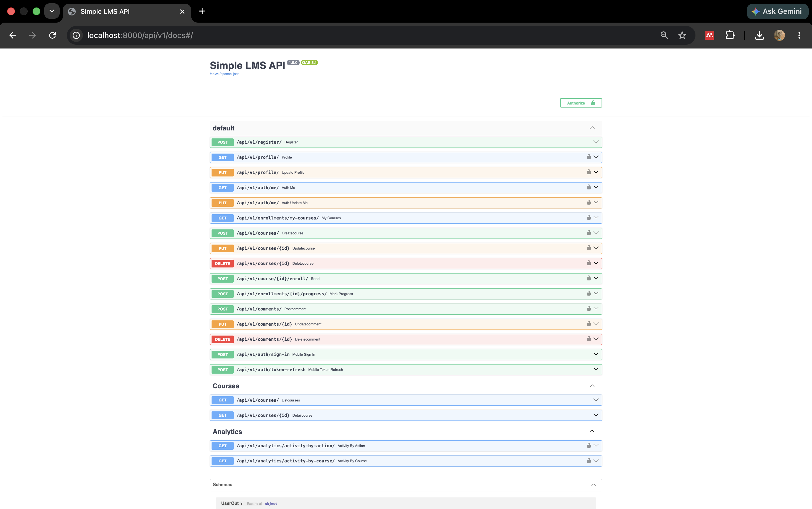

---

# Redis Integration

Redis digunakan sebagai cache layer untuk mengurangi query PostgreSQL pada data course yang sering diakses.

## 1. Course List Caching

Endpoint:

```http
GET /api/v1/courses/
```

Redis key:

```text
:1:courses_list
```

TTL:

```text
300 detik
```

Command pengecekan:

```bash
docker-compose exec redis redis-cli -n 1 KEYS "*"
```

## Screenshot Course List Cache

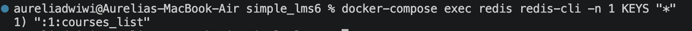

---

## 2. Course Detail Caching

Endpoint:

```http
GET /api/v1/courses/{id}
```

Redis key:

```text
:1:course_detail:{id}
```

Contoh:

```text
:1:course_detail:1
```

Command pengecekan:

```bash
docker-compose exec redis redis-cli -n 1 KEYS "*"
```

## Screenshot Course Detail Cache

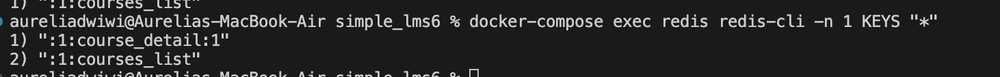

---

## 3. Redis TTL

TTL digunakan agar data cache memiliki waktu kedaluwarsa.

Command pengecekan:

```bash
docker-compose exec redis redis-cli -n 1 TTL ":1:courses_list"
docker-compose exec redis redis-cli -n 1 TTL ":1:course_detail:1"
```

## Screenshot Redis TTL

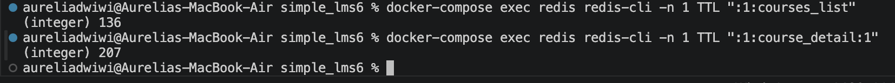

---

## 4. Caching Strategy Explanation

Strategi caching yang digunakan adalah **cache-aside pattern**.

Alur caching:

```text
Request masuk
    │
    ▼
cache.get(key)
    │
    ├─ HIT  ──► return cached data tanpa query database
    │
    └─ MISS ──► query PostgreSQL
                    │
                    ▼
              cache.set(key, data, timeout=300)
                    │
                    ▼
              return data
```

---

## 5. Cache Invalidation Strategy

Cache dihapus ketika terjadi operasi write agar data tidak stale.

### Create Course

```python
cache.delete("courses_list")
```

### Update Course

```python
cache.delete("courses_list")
cache.delete(f"course_detail:{id}")
```

### Delete Course

```python
cache.delete("courses_list")
cache.delete(f"course_detail:{id}")
```

Command bukti invalidasi:

```bash
docker-compose exec redis redis-cli -n 1 KEYS "*"
```

## Screenshot Cache Invalidation

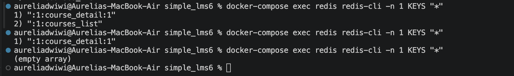

---

## 6. Rate Limiting

Rate limiting diterapkan menggunakan Redis counter.

Limit:

```text
60 requests / minute
```

Jika melebihi limit, API mengembalikan:

```json
{
  "detail": "Rate limit exceeded. Maksimal 60 requests per minute."
}
```

Status code:

```text
429 Too Many Requests
```

## Screenshot Rate Limiting

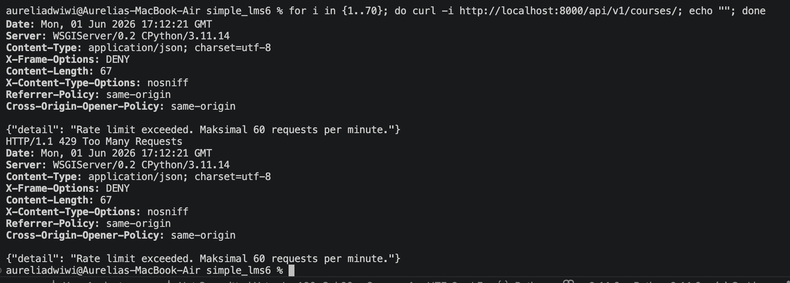

---

## 7. Redis CLI Commands Documentation

Masuk Redis CLI:

```bash
docker-compose exec redis redis-cli
```

Cek koneksi:

```bash
PING
```

Melihat semua key pada Redis DB 1:

```bash
docker-compose exec redis redis-cli -n 1 KEYS "*"
```

Melihat TTL course list:

```bash
docker-compose exec redis redis-cli -n 1 TTL ":1:courses_list"
```

Melihat TTL course detail:

```bash
docker-compose exec redis redis-cli -n 1 TTL ":1:course_detail:1"
```

Menghapus seluruh cache DB 1:

```bash
docker-compose exec redis redis-cli -n 1 FLUSHDB
```

Melihat counter rate limit:

```bash
docker-compose exec redis redis-cli -n 1 KEYS "*rate_limit*"
```

## Screenshot Redis CLI Monitoring

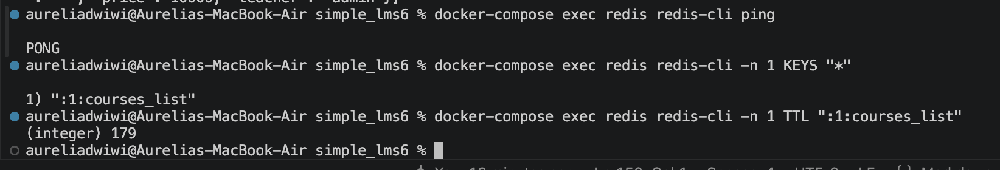

---

# MongoDB Integration

MongoDB digunakan untuk menyimpan data berbentuk dokumen, yaitu **activity logs** dan **learning analytics**.

Database:

```text
lms_analytics
```

## 1. Activity Log Collection

Collection:

```text
activity_logs
```

Collection ini menyimpan aktivitas user seperti:

- create_course
- update_course
- delete_course
- enroll
- progress
- comment

Contoh dokumen:

```json
{
  "user_id": 1,
  "action": "create_course",
  "course_id": 1,
  "course_name": "metopen",
  "timestamp": "2026-06-01T14:04:55.051Z",
  "metadata": {}
}
```

Command pengecekan (ganti `mongo`/password sesuai `MONGO_INITDB_ROOT_USERNAME`/`MONGO_INITDB_ROOT_PASSWORD` di `.env`):

```bash
docker exec -it lms-mongodb mongosh -u mongo -p
```

```javascript
use lms_analytics
db.activity_logs.find().pretty()
```

## Screenshot Activity Logs

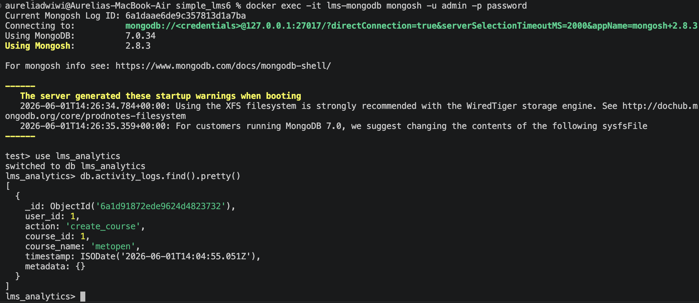

---

## 2. Learning Analytics Collection

Collection:

```text
learning_analytics
```

Collection ini digunakan untuk menyimpan data analitik pembelajaran seperti progress user, completion status, dan aktivitas belajar.

Contoh dokumen:

```json
{
  "user_id": 1,
  "course_id": 1,
  "progress_percentage": 100,
  "completed": true,
  "timestamp": "2026-06-01T14:10:00.000Z"
}
```

Command pengecekan:

```javascript
use lms_analytics
db.learning_analytics.find().pretty()
```

## Screenshot Learning Analytics

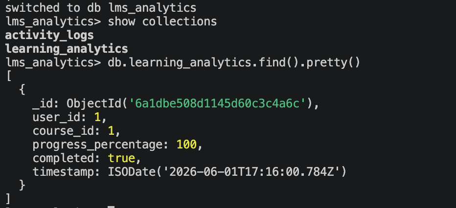

---

## 3. Aggregation Queries untuk Reports (Paket 5)

### Activity by Action

```javascript
db.activity_logs.aggregate([
  { $group: { _id: "$action", total: { $sum: 1 } } },
  { $sort: { total: -1 } },
]);
```

Endpoint API: `GET /api/v1/analytics/activity-by-action/`

### Daily Active Users

```javascript
db.activity_logs.aggregate([
  {
    $group: {
      _id: { $dateToString: { format: "%Y-%m-%d", date: "$timestamp" } },
      active_users: { $addToSet: "$user_id" },
    },
  },
  { $project: { total_active_users: { $size: "$active_users" } } },
  { $sort: { _id: -1 } },
]);
```

Endpoint API: `GET /api/v1/analytics/daily-active-users/`

### Course Popularity

```javascript
db.activity_logs.aggregate([
  { $match: { course_id: { $ne: null } } },
  {
    $group: {
      _id: "$course_name",
      total_activity: { $sum: 1 },
      unique_users: { $addToSet: "$user_id" },
    },
  },
  {
    $project: {
      total_activity: 1,
      unique_user_count: { $size: "$unique_users" },
    },
  },
  { $sort: { total_activity: -1 } },
]);
```

Endpoint API: `GET /api/v1/analytics/course-popularity/`

### Completion Summary

```javascript
db.learning_analytics.aggregate([
  {
    $group: {
      _id: "$course_id",
      total_snapshots: { $sum: 1 },
      completed_snapshots: {
        $sum: { $cond: [{ $eq: ["$completed", true] }, 1, 0] },
      },
    },
  },
  { $sort: { _id: 1 } },
]);
```

Endpoint API: `GET /api/v1/analytics/completion-summary/`
(Persentase `completion_ratio_percent` dihitung di Python setelah data diambil, bukan di pipeline — lihat catatan di `analytics/mongo_service.py`.)

### Course Analytics Report (gabungan PostgreSQL + Celery Beat)

Berbeda dari 4 query di atas (yang baca MongoDB), endpoint ini baca tabel
`CourseStatistics` di PostgreSQL yang diperbarui otomatis oleh Celery Beat
tiap 5 menit:

Endpoint API: `GET /api/v1/analytics/course-report/`

## Screenshot MongoDB Aggregation

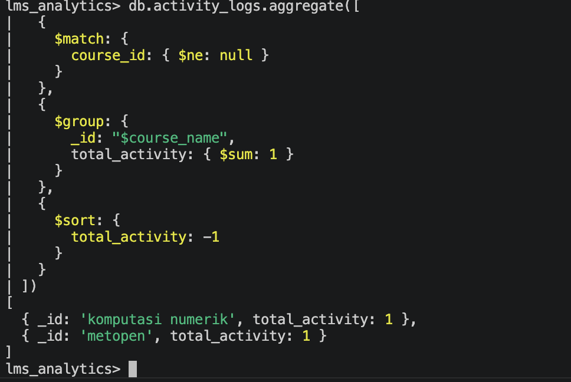

---

# Celery Tasks

Celery digunakan untuk menjalankan proses asynchronous di background agar request API tidak perlu menunggu proses berat selesai.

Celery menggunakan:

- RabbitMQ sebagai message broker
- Redis sebagai result backend
- Celery Beat sebagai scheduler
- Flower sebagai monitoring dashboard

## Daftar Celery Tasks

| Task                     | Trigger                                           | Tipe            |
| ------------------------ | ------------------------------------------------- | --------------- |
| send_enrollment_email    | Saat student enroll course                        | Async on-demand |
| generate_certificate     | Saat student menyelesaikan course (100% progress) | Async on-demand |
| update_course_statistics | Otomatis setiap 5 menit                           | Scheduled       |
| export_course_report     | Manual via admin task endpoint                    | Async on-demand |

Status semua task di atas bisa dicek lewat `GET /api/v1/tasks/{task_id}/status/`.

## 1. send_enrollment_email

Task ini berjalan ketika student enroll course. Email dikirim lewat Django
email backend (console backend di development — "terkirim" dalam arti
tercatat di log, bukan SMTP asli).

Trigger:

```http
POST /api/v1/course/{id}/enroll/
```

Contoh pemanggilan task:

```python
send_enrollment_email.delay(user.id, course.id)
```

## Screenshot send_enrollment_email

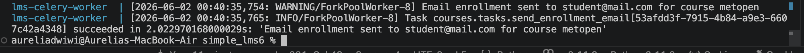

---

## 2. generate_certificate

Task ini generate certificate ketika student menyelesaikan 100% konten
sebuah course. Hasilnya **disimpan ke tabel `Certificate`** (idempoten —
tidak akan duplikat kalau dipanggil berkali-kali untuk user+course yang
sama). Certificate bisa dilihat lewat `GET /api/v1/certificates/my/`.

## Screenshot generate_certificate

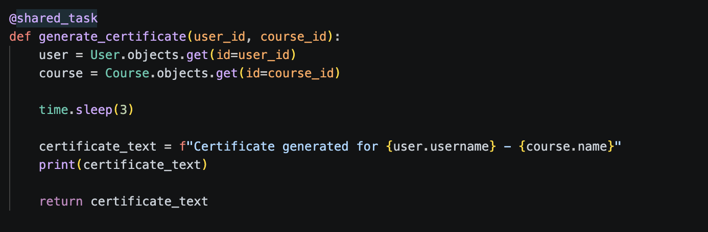

---

## 3. update_course_statistics

Task ini berjalan otomatis menggunakan Celery Beat (tiap 5 menit) untuk
menghitung ulang `enrollment_count`, `completed_count`, dan
`completion_rate` setiap course, lalu menyimpannya ke tabel
`CourseStatistics`. Data ini yang dibaca oleh endpoint Paket 5
`GET /api/v1/analytics/course-report/`.

Contoh log:

```text
Task courses.tasks.update_course_statistics received
Course statistics updated
Task courses.tasks.update_course_statistics succeeded
```

## Screenshot Scheduled Task

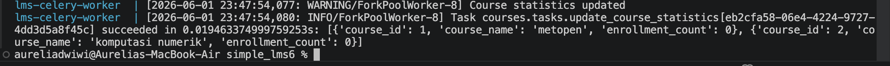

---

## 4. export_course_report

Task ini generate CSV report course secara asynchronous.

Output:

```text
reports/course_report.csv
```

File hasilnya bisa diunduh lewat `GET /api/v1/admin/tasks/export-report/download/`.

## Screenshot export_course_report

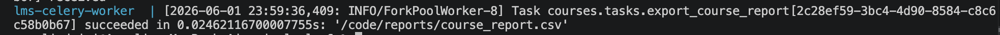

---

## Screenshot Celery Tasks Code

Screenshot ini menunjukkan file `courses/tasks.py` berisi minimal empat task yang diminta.

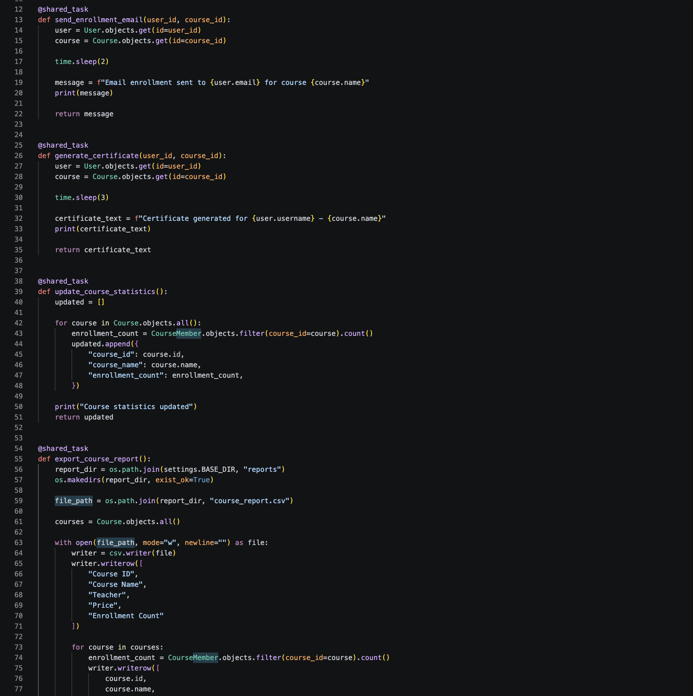

---

## Task Flow Documentation

### Enrollment Task Flow

```text
POST /course/{id}/enroll/
        │
        ▼
Simpan enrollment ke PostgreSQL
        │
        ▼
Simpan activity log ke MongoDB
        │
        ▼
send_enrollment_email.delay(user_id, course_id)
        │
        ▼
RabbitMQ Queue
        │
        ▼
Celery Worker mengambil task
        │
        ▼
Task dijalankan di background
        │
        ▼
Result disimpan ke Redis result backend
```

### Scheduled Task Flow

```text
Celery Beat setiap 5 menit
        │
        ▼
Enqueue update_course_statistics ke RabbitMQ
        │
        ▼
Celery Worker menerima task
        │
        ▼
Worker menghitung enrollment count tiap course
        │
        ▼
Task selesai dan termonitor di Flower
```

---

# Monitoring

Monitoring dilakukan menggunakan Flower, RabbitMQ Management UI, Redis CLI, dan log Celery Worker.

## 1. Celery Worker Logs

Command:

```bash
docker-compose logs celery-worker --tail=80
```

## Screenshot Celery Worker Logs

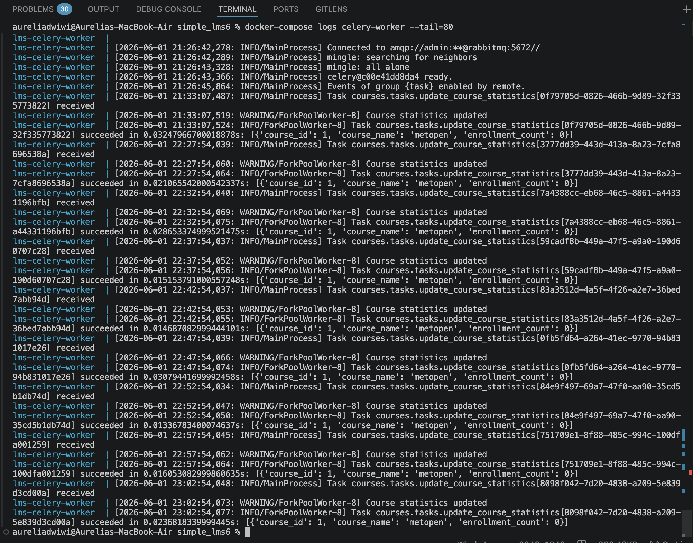

---

## 2. Flower Monitoring

URL:

```text
http://localhost:5555
```

Flower digunakan untuk monitoring:

- Celery workers
- Task status
- Task runtime
- Task success / failure

## Screenshot Flower Dashboard

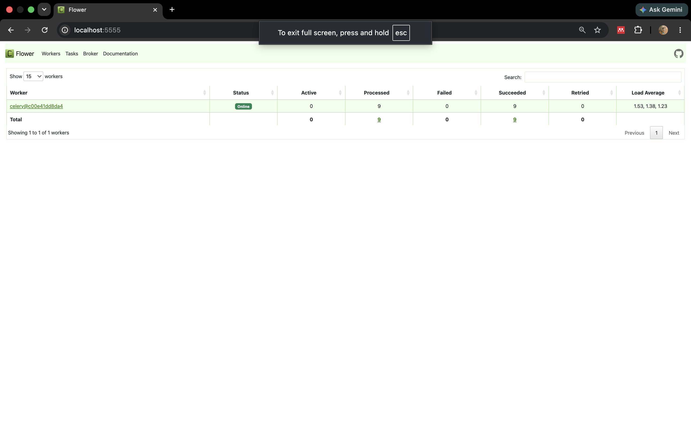

---

## 3. RabbitMQ Monitoring

URL:

```text
http://localhost:15672
```

Login: gunakan `RABBITMQ_DEFAULT_USER` / `RABBITMQ_DEFAULT_PASS` sesuai file `.env`.

RabbitMQ Management digunakan untuk monitoring:

- Queue
- Connection
- Channel
- Message broker status

## Screenshot RabbitMQ Dashboard

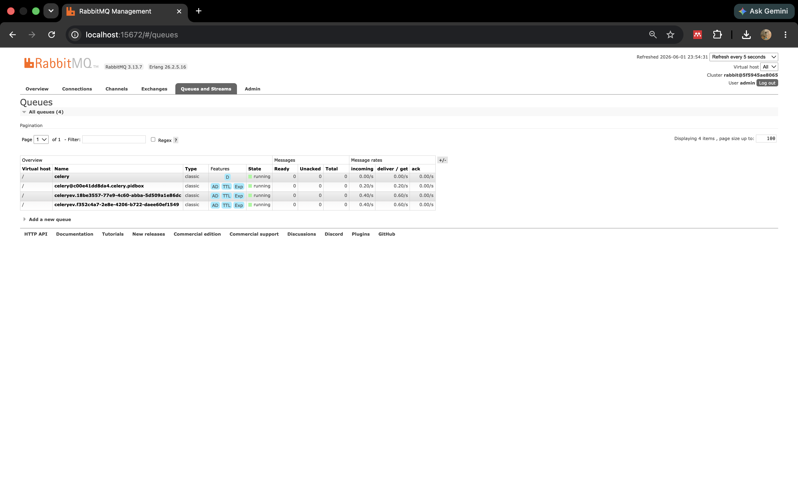

---

## 4. Redis CLI Monitoring

Command:

```bash
docker-compose exec redis redis-cli -n 1 KEYS "*"
docker-compose exec redis redis-cli -n 1 TTL ":1:courses_list"
```

## Screenshot Redis Monitoring


---

# Benchmark Performance

Benchmark dilakukan untuk mengukur response time endpoint course setelah caching aktif.

File:

```text
benchmark.py
```

Command:

```bash
python3 benchmark.py
```

Contoh hasil benchmark:

```text
GET /courses/
  Success   : 50
  Failed    : 0
  Rata-rata : 4.38 ms
  Minimum   : 2.03 ms
  Maksimum  : 35.83 ms

GET /courses/1
  Success   : 50
  Failed    : 0
  Rata-rata : 2.62 ms
  Minimum   : 1.96 ms
  Maksimum  : 20.45 ms
```

Setelah benchmark dijalankan, Redis menyimpan:

```text
:1:courses_list
:1:course_detail:1
```

TTL cache aktif:

```text
(integer) 210
```

## Screenshot Benchmark Result

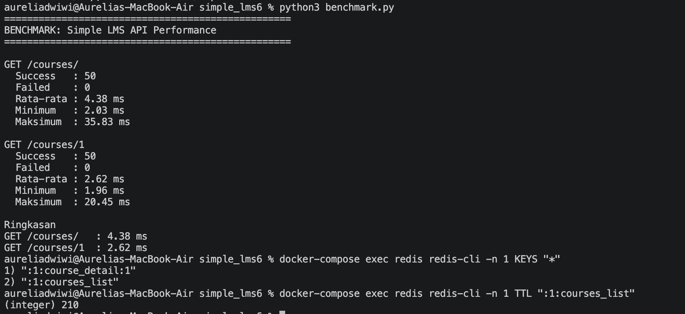

---

# API Endpoints

## Authentication Endpoints

| Method | Endpoint                   | Auth  | Keterangan                                                                                                                            |
| ------ | -------------------------- | ----- | ------------------------------------------------------------------------------------------------------------------------------------- |
| POST   | /api/v1/register/          | Tidak | Register user baru. Body bisa menyertakan `role`: `student` (default) atau `instructor`. Role `admin` tidak bisa didaftarkan sendiri. |
| POST   | /api/v1/auth/sign-in       | Tidak | Login, dapat access dan refresh token                                                                                                 |
| POST   | /api/v1/auth/token-refresh | Tidak | Refresh access token                                                                                                                  |
| GET    | /api/v1/profile/           | Ya    | Lihat profil user login                                                                                                               |
| PUT    | /api/v1/profile/           | Ya    | Update profil user login                                                                                                              |

## Categories Endpoints

| Method | Endpoint            | Auth             | Keterangan             |
| ------ | ------------------- | ---------------- | ---------------------- |
| GET    | /api/v1/categories/ | Tidak            | Daftar kategori course |
| POST   | /api/v1/categories/ | Instructor/Admin | Buat kategori baru     |

## Courses Endpoints

| Method | Endpoint                              | Auth             | Keterangan                                                                                            |
| ------ | ------------------------------------- | ---------------- | ----------------------------------------------------------------------------------------------------- |
| GET    | /api/v1/courses/?category_id=&search= | Tidak            | Daftar course (Redis cached untuk query tanpa filter), rate limited, bisa filter kategori & cari nama |
| GET    | /api/v1/courses/{id}                  | Tidak            | Detail course, Redis cached, rate limited                                                             |
| POST   | /api/v1/courses/                      | Instructor/Admin | Buat course baru                                                                                      |
| PUT    | /api/v1/courses/{id}                  | Pemilik/Admin    | Update course                                                                                         |
| DELETE | /api/v1/courses/{id}                  | Pemilik/Admin    | Hapus course                                                                                          |

## Enrollment, Progress & Certificate Endpoints

| Method | Endpoint                           | Auth                    | Keterangan                                                                                                                                                                                                                                     |
| ------ | ---------------------------------- | ----------------------- | ---------------------------------------------------------------------------------------------------------------------------------------------------------------------------------------------------------------------------------------------- |
| POST   | /api/v1/course/{id}/enroll/        | Ya                      | Enroll course, trigger `send_enrollment_email` async                                                                                                                                                                                           |
| GET    | /api/v1/enrollments/my-courses/    | Ya                      | Daftar course yang diikuti                                                                                                                                                                                                                     |
| POST   | /api/v1/enrollments/{id}/progress/ | Ya (pemilik enrollment) | Tandai 1 konten/lesson selesai. Progress **disimpan ke tabel `Progress`**, persentase dihitung ulang, snapshot disimpan ke MongoDB `learning_analytics`. Jika course baru menjadi 100% selesai, otomatis trigger `generate_certificate` async. |
| GET    | /api/v1/certificates/my/           | Ya                      | Daftar certificate milik user yang login                                                                                                                                                                                                       |

## Analytics Endpoints — Paket 5 (Admin/Instructor)

| Method | Endpoint                              | Auth              | Keterangan                                                                                                                                                                    |
| ------ | ------------------------------------- | ----------------- | ----------------------------------------------------------------------------------------------------------------------------------------------------------------------------- |
| GET    | /api/v1/analytics/course-report/      | Admin, Instructor | Laporan per-course: enrollment_count, completed_count, completion_rate. Sumber data tabel `CourseStatistics` (PostgreSQL), diperbarui otomatis tiap 5 menit oleh Celery Beat. |
| GET    | /api/v1/analytics/daily-active-users/ | Admin             | Aggregation MongoDB: jumlah user unik aktif per tanggal                                                                                                                       |
| GET    | /api/v1/analytics/course-popularity/  | Admin             | Aggregation MongoDB: total aktivitas & jumlah user unik per course                                                                                                            |
| GET    | /api/v1/analytics/completion-summary/ | Admin             | Aggregation MongoDB: rasio completed vs total snapshot progress per course (dari `learning_analytics`)                                                                        |
| GET    | /api/v1/analytics/activity-by-action/ | Admin             | Aggregation MongoDB: jumlah aktivitas dikelompokkan per jenis action                                                                                                          |

## Admin Tasks & User Management — Paket 6 (Admin Only)

| Method | Endpoint                                    | Auth  | Keterangan                                                                                     |
| ------ | ------------------------------------------- | ----- | ---------------------------------------------------------------------------------------------- |
| GET    | /api/v1/admin/users/                        | Admin | Daftar semua user beserta role efektifnya                                                      |
| PUT    | /api/v1/admin/users/{id}/role/              | Admin | Ubah role user (`student`/`instructor`)                                                        |
| POST   | /api/v1/admin/tasks/export-report/          | Admin | Trigger `export_course_report` async, balikan `task_id`                                        |
| GET    | /api/v1/admin/tasks/export-report/download/ | Admin | Download file CSV hasil export terakhir                                                        |
| POST   | /api/v1/admin/tasks/update-statistics/      | Admin | Trigger `update_course_statistics` async, balikan `task_id`                                    |
| GET    | /api/v1/tasks/{task_id}/status/             | Ya    | Cek status Celery task (`PENDING`/`STARTED`/`SUCCESS`/`FAILURE`) berdasarkan `task_id` di atas |

## Comments Endpoints

| Method | Endpoint              | Auth                                       | Keterangan                         |
| ------ | --------------------- | ------------------------------------------ | ---------------------------------- |
| POST   | /api/v1/comments/     | Ya                                         | Tambah komentar pada konten/lesson |
| PUT    | /api/v1/comments/{id} | Pemilik komentar                           | Edit komentar                      |
| DELETE | /api/v1/comments/{id} | Pemilik komentar / pengajar course / admin | Hapus komentar                     |

---

# Testing

Test mencakup: registrasi & role, RBAC (student vs instructor vs admin),
ownership permission (course & comment), flow enrollment → progress →
course selesai → certificate task terpicu, scheduled task statistics,
export report + download, task status, serta 3 aggregation pipeline
MongoDB (Paket 5) dan endpoint admin-only. **Total 46 test case.**

Jalankan test (tanpa perlu Docker, pakai SQLite + Celery eager + cache
in-memory + mongomock — lihat `lms/settings_test.py`):

```bash
cd code
pip install -r requirements.txt
DJANGO_SETTINGS_MODULE=lms.settings_test python manage.py test courses -v 2
```

Atau di dalam container Docker:

```bash
docker-compose exec app sh -c "DJANGO_SETTINGS_MODULE=lms.settings_test python manage.py test courses -v 2"
```

Catatan: saat dijalankan tanpa MongoDB (mis. di CI), `analytics/mongo_service.py`
akan mencatat warning di log tapi **tidak menggagalkan request utama** —
ini sengaja didesain demikian (graceful degradation) agar API tetap bisa
diuji walau MongoDB belum siap.

**Catatan penting soal Celery saat testing**: Celery membaca
`CELERY_BROKER_URL` dan `CELERY_RESULT_BACKEND` langsung dari
`os.environ` jika ada di sana — ini PRIORITAS LEBIH TINGGI daripada
apapun yang diset di `settings.py`/`settings_test.py` sebagai variabel
Django biasa. Karena `settings.py` memanggil `load_dotenv()` (membaca file
`.env` yang isinya konfigurasi untuk Docker), variabel itu "bocor" ke
`os.environ` proses Python. `lms/settings_test.py` sudah menangani ini
dengan `os.environ.pop("CELERY_BROKER_URL", None)` dan
`os.environ.pop("CELERY_RESULT_BACKEND", None)` di baris paling atas —
JANGAN dihapus, atau test yang memicu Celery task akan gagal connect ke
Redis Docker (`redis:6379`) saat dijalankan di luar Docker.

---

# Keamanan & Konfigurasi

- Semua kredensial (PostgreSQL, MongoDB, RabbitMQ, `SECRET_KEY`) dibaca dari
  environment variable lewat file `.env` (lihat `.env.example`). Tidak ada
  password yang hardcode di kode atau `docker-compose.yml`.
- File JWT signing key (`jwt-signing.pem`, `jwt-signing.pub`) **tidak**
  disertakan di repository dan masuk `.gitignore`. Key di-generate otomatis
  oleh `entrypoint.sh` saat container pertama kali jalan (atau manual lewat
  `python manage.py make_jwt_key`).
- Endpoint admin (`/admin/users/`, `/admin/tasks/*`, `/analytics/*`) hanya
  bisa diakses oleh user dengan `is_superuser=True`.
